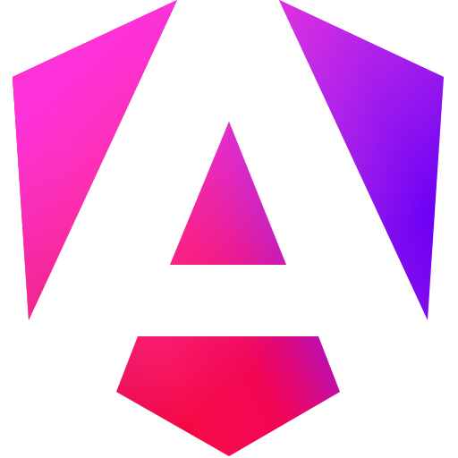
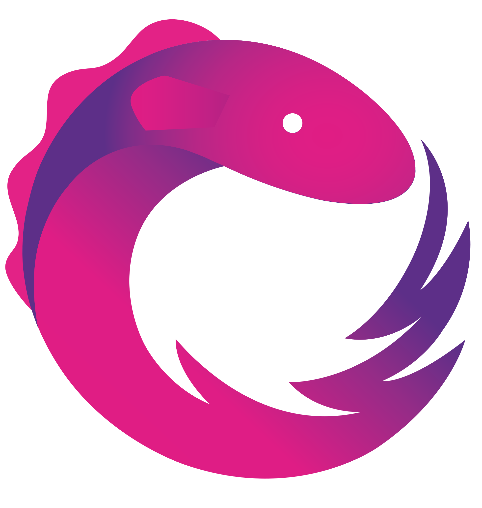
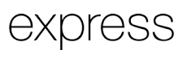
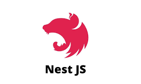

<h1 align="center">Hi 👋, I'm Andrew Andrusenko</h1>
<h3 align="center">Senior Full Stack developer with solid financial markets expertise</h3>

  

- 🔭 I’m currently closing up [CRM project for Systems Soultion](https://p2zpsq4w-5001.euw.devtunnels.ms/apps/aam/login) and looking forward to join a new intersting project
- 💰 [Asset Management Platform](https://p2zpsq4w-5001.euw.devtunnels.ms/apps/aam/login) is another my big project for financial companies. I'm plannig to update its design and introduce new features

- 🌱 Main stack is **Angular (+RxJs deep), Node.js, PostgreSQL** 

- 💡I'm constantly expanding my knowledge base. There is my extended tech stack:
  - Express, WebSockets, NestJs, MongoDB, Redis, Passport.js, Nodemailer, JWT, Bcrypt, Jest, Pino Logger.
  - Data visualization: ECharts, Konva.js, Elkjs, Dagre

- 🤝 I’m ready to contribute to new inspiring ideas and projects

- 💬 Ask me about *my projects and tech stack*. I would love to help out and share my ideas

- 📫 How to reach me **aandrusenko3@gmail.com**

- ⚡ Fun fact: I like doing something better than doing PR

<h3 align="left">Connect with me:</h3>
 
 
<h3 align="left">Languages and Tools:</h3>

   &nbsp;
    &nbsp;
    &nbsp;
    &nbsp;
    &nbsp;
    &nbsp;
    &nbsp;

    &nbsp;
    &nbsp;
    &nbsp;
    &nbsp;
    &nbsp;
    &nbsp;
    &nbsp;
  

&nbsp;

