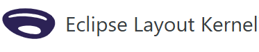
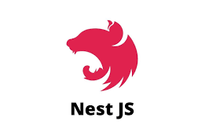

<h1 align="center">Hi 👋, I'm Andrew Andrusenko</h1>
<h3 align="center">Senior Full-Stack / Frontend Engineer specializing in FinTech Architectures & Web Performance</h3>

  

---

### 💻 Engineering Profile
I am a performance-focused Full-Stack Engineer with an extensive background in the financial sector (including operations automation at **BNP Paribas** and infrastructure deployment at **Renaissance Investment Management**). I specialize in bridging deep financial domain logic with production-grade, highly secure software systems. 

*   **Core Architectural Focus:** Real-time data streaming (WebSockets), reactive state management (Advanced RxJS semaphores), enterprise database isolation (PostgreSQL RLS), and lightweight infrastructure containerization.
*   **Performance Metrics:** Achieved up to **6.5x frontend bundle reduction** via Brotli/lazy loading and optimized Docker footprint by **cutting image sizes from 1.44 GB to 300 MB**.

---

### 🚀 Production Product Showcase

| Product / Platform | Live System Architecture | Source Code | Core Engineering Highlights |
| :--- | :--- | :--- | :--- |
| **Enterprise Asset Management (AMP)** | 🌐 [Live App Demo](https://devtunnels.ms) | 🔒 *Private Repo* | Full cycle PMS/OMS system. **69 tables**, 82 DB functions, and **18 Row-Level Security (RLS)** policies in PostgreSQL. Automated FIFO tracking and TWRR analytics. |
| **Real-Time Stock Quotes Engine** | 📈 [Live Streaming Demo](https://devtunnels.ms) | 🐱 [Frontend](https://github.com)   🐱 [Backend](https://github.com) | High-frequency data stream processing **under 50ms**. Loop-free data throttling via **RxJS buffering semaphores** to eliminate layout freeze. |
| **Central Identity Provider (IdP)** | 🔑 [Live Auth Demo](https://devtunnels.ms) | 🐱 [Core Auth Backend](https://github.com) | Standalone Auth Server. **HttpOnly + SameSite=Lax cookie-encapsulated JWT architecture** for XSS protection. Lockless sync via **RxJS `exhaustMap` pattern**. |
| **Low-Code Enterprise Platform** | 🏢 [Live Platform Demo 1](https://ppklrx85-5001.euw.devtunnels.ms/apps/crm1/)   🏢 [Live Platform Demo 2](https://devtunnels.ms) | 🔒 *Private Repo* | Distributed low-code infrastructure. Built an in-house interactive chart and diagram rendering library utilizing **Konva, Elk, and Dagre**. |
---

### 🛠️ Core Technology Stack

  <strong>Frontend Engineering:</strong> 
   &nbsp;
   &nbsp;
   &nbsp;
   &nbsp;
   &nbsp;
  

  <strong>Backend, Databases & Security:</strong> 
   &nbsp;
   &nbsp;
   &nbsp;
   &nbsp;
   &nbsp;
   &nbsp;
   &nbsp;
  

---

### 📊 GitHub Ecosystem Metrics

---
src="https://herokuapp.com" alt="GitHub Streak" />

---

### 🤝 Connect with Me
*   **Email:** aandrusenko3@gmail.com
*   **LinkedIn:** [Andrew Andrusenko on LinkedIn](https://linkedin.com)
